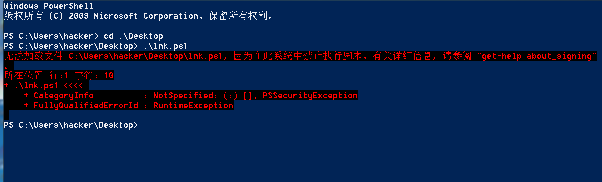
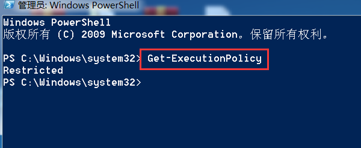
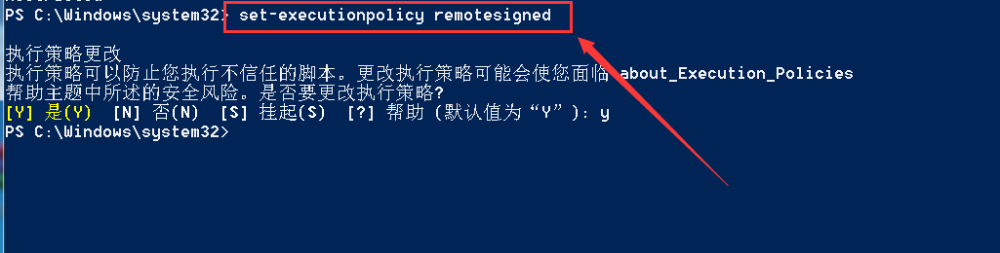

# 问题详述

使用Windows Powershell命令执行ps1脚本时出现如下图所示错误

出现这种情况的原因时计算机启动windows Powershell时，默认的执行策略为Restricted

> Restricted: 执行策略不允许任何脚本执行
>
> AllSigned和RemoteSigned: 允许执行有数字签名的脚本

# 解决方法

使用管理员权限打开Windows Powershell, 输入`get-executionpolicy`, 查看Powershell命令的执行策略, 显示`Restricted`表示不允许执行ps脚本

输入`set-executionpolicy remotesigned`, 设置允许执行ps脚本

​			