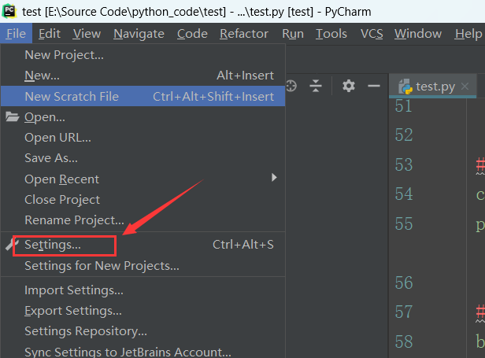
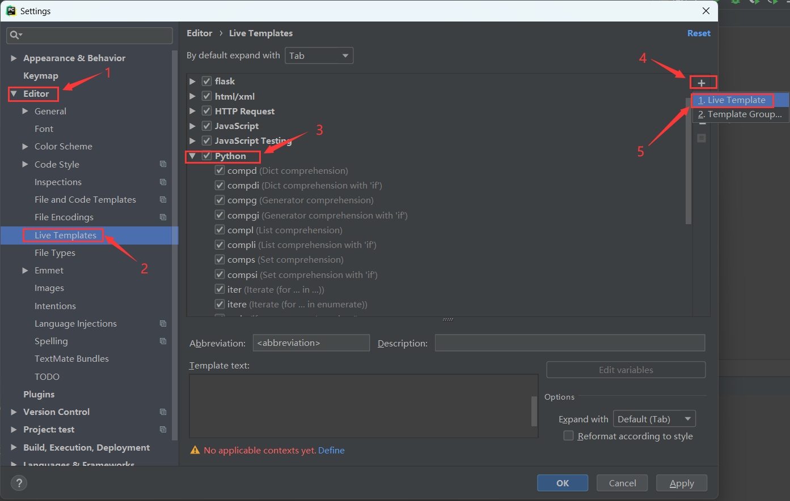
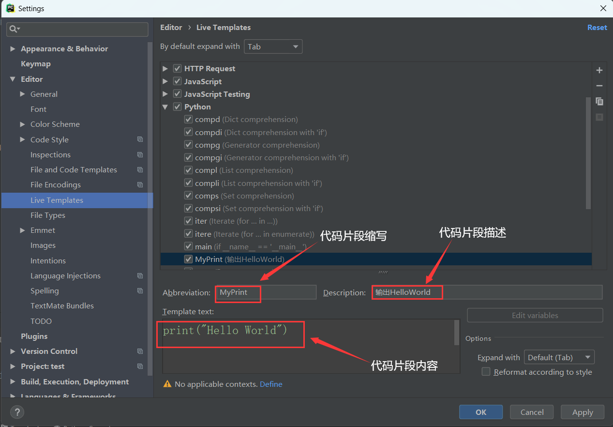
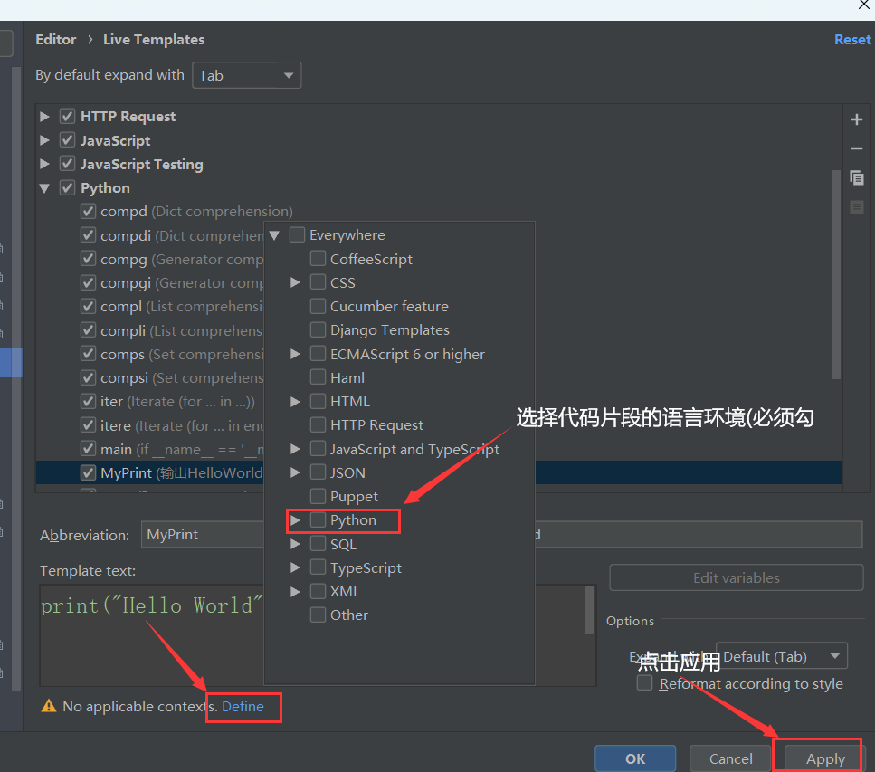
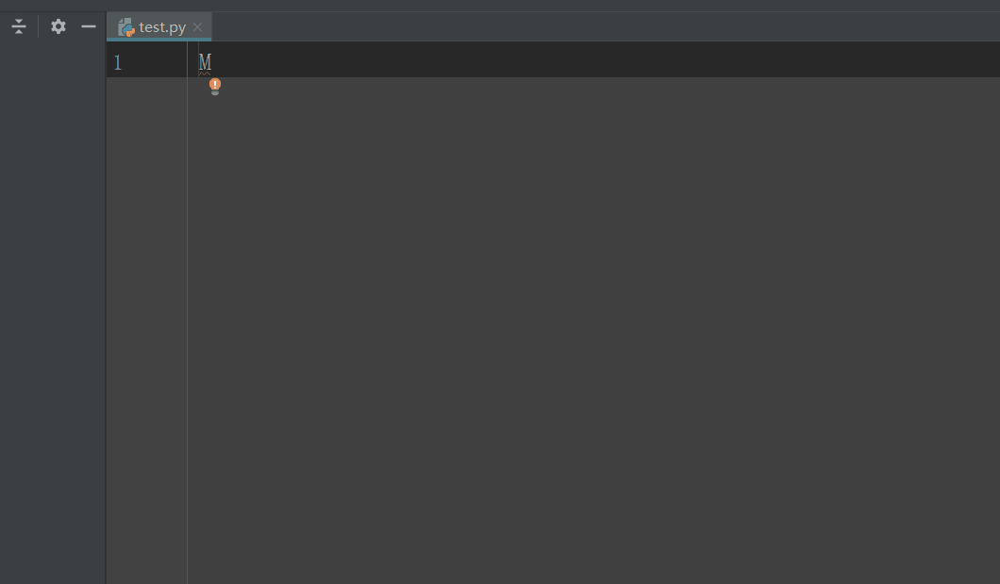
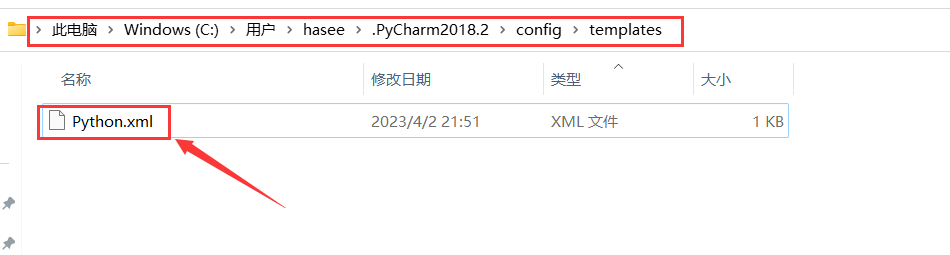
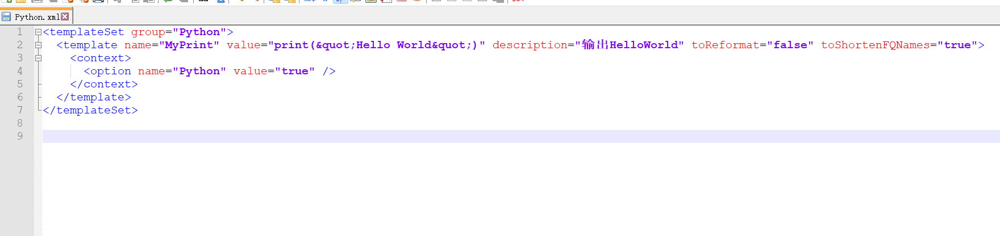

# 简介

PyCharm允许您创建自定义代码片段，也称为代码模板，以提高您的开发效率

# 实现步骤

## 1.添加代码模板

打开PyCharm并导航到`File->Settings`，或者按快捷键`ctrl + alt + s` 打开设置

	

​	

按照如下序号步骤进行点击，点击“+”按钮以创建新的代码模板，选择`Live Template`，此处可以看到很多pycharm自己定义好的代码片段

## 2.设置代码模板

下图是代码片段的使用方法，在`Abbreviation`字段中输入代码片段的快捷方式，在`Template text`字段中输入代码片段的实际代码，在`Description`字段输入代码片段的描述

点击`Define`设置代码片段的适用语言

	

​	

## 3.测试效果

测试效果如下图所示：

	

# 代码模板的保存

pycharm会将代码片段保存在xml文件中，例如我的xml文件是放在`C:\Users\hasee\.PyCharm2018.2\config\templates`，可以将存放代码片段的xml文件放到其他pycharm的templates目录中进行使用

	

​			

​			