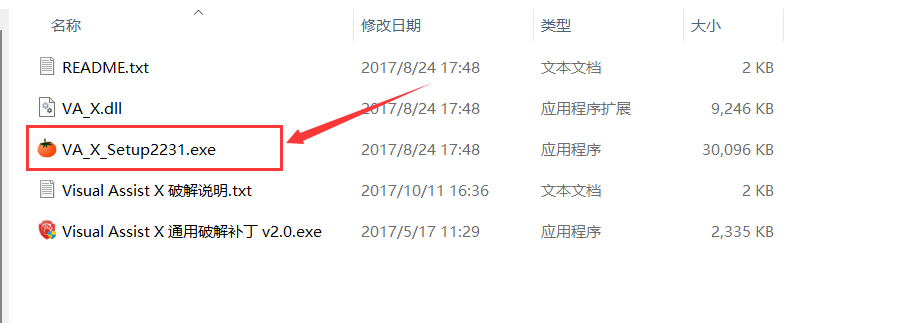
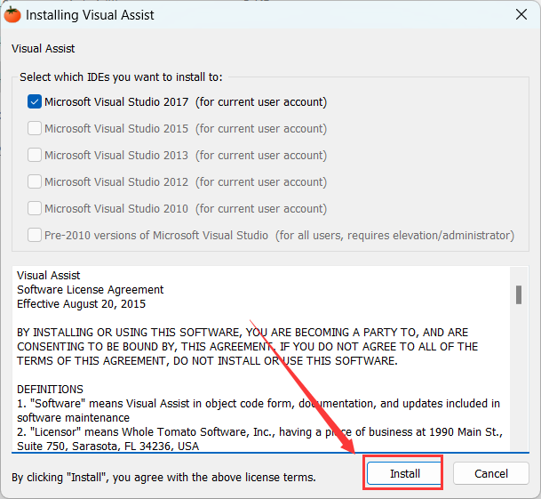
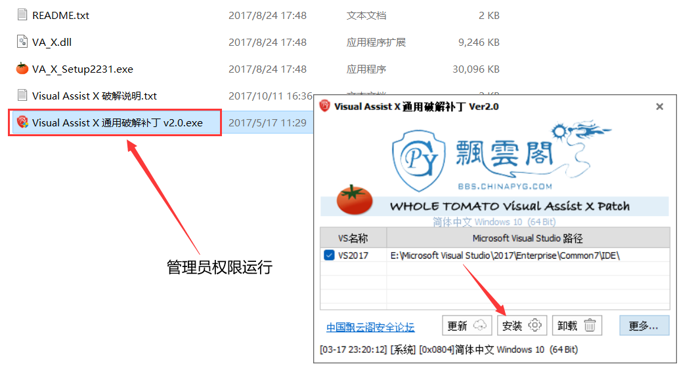
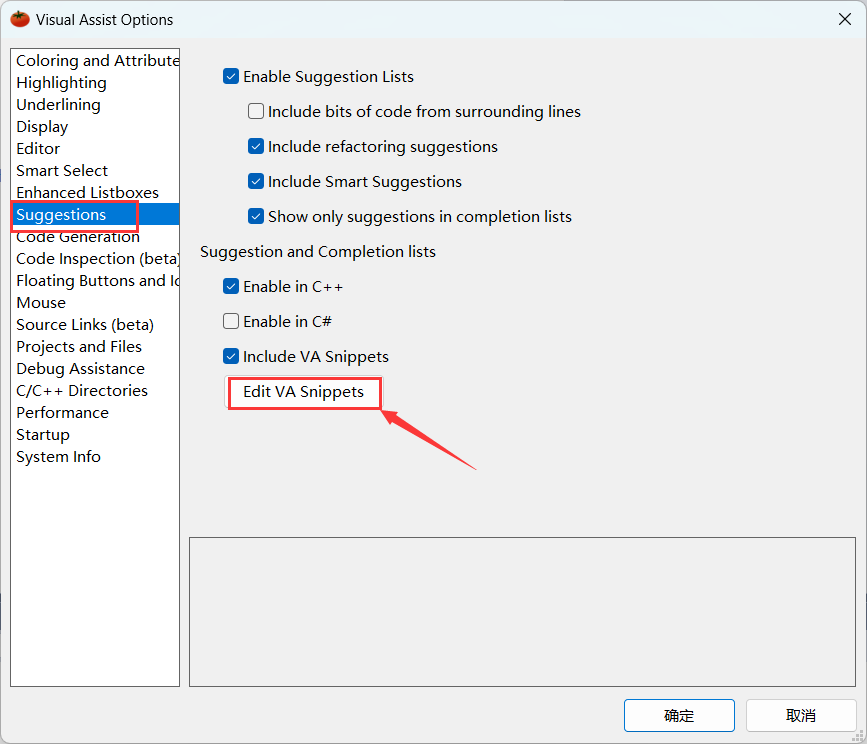
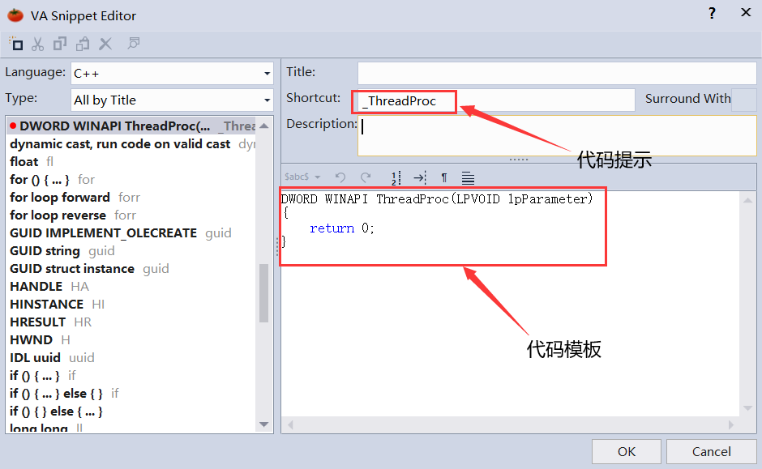

# 番茄助手介绍

Visual Assist x（番茄助手）是一款专业的Visual Studio编程插件，适用于VC6.0和Visual Studio的各个版本，内置丰富的功能型插件，支持多种编程语言，包括C/C、C#、Visual Basic等，可以进行代码重构、代码生成、代码编写、代码修正、代码检查等操作，帮助提高开发效率

# 步骤

## 1.安装番茄助手

打开番茄助手所在目录，运行`VA_X_Setup2231.exe`进行安装

	

选择对应的Visual Studio版本，此处我的VS版本是2017的

	

## 2.运行破解补丁

安装完番茄助手后，使用管理员权限运行破解补丁，随后点击安装

		

/image-20230318193735692.png)	

## 3.设置代码提示

重启Visual Studio，选择上方的`VAssistX`运行番茄助手，点击设置

/image-20230318193750425.png)	

点击`Suggestions->Edit VA Snippets`

`

填写代码提示词以及代码模板

	

只要代码提示词就可以使用自定义的代码模板了

/动画.gif)

# 番茄助手破解版下载地址

链接：https://pan.baidu.com/s/10CfJksHkL-tJUJB-xxtBmw 
提取码：kmyr		

​		

​	

​	
