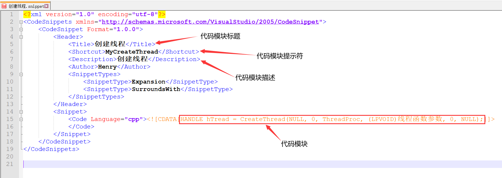

# 问题描述

Visual Studio提供了Code Snippet Manager功能，这使得用户可以自定义代码片段。用户可以在Code Snippet Manager中创建自己的代码片段，并指定一个唯一的提示符。一旦定义了代码片段，用户只需输入提示符，就能轻松地将其插入到代码编辑器中。

使用代码片段管理器可以极大地提高编码的效率。如果你经常写重复的代码块，使用代码片段管理器就可以快速插入这些代码块，而不用每次都手动输入。代码片段管理器也可以帮助用户在不同的项目中共享代码块，从而提高团队的协作效率。


# 解决步骤

## 1.创建存放代码模块文件的目录

此处我在VS目录创建一个Mycode目录，用于存放代码模块文件(`.snippet`)

	


## 2.新建模块文件

新建一个用于创建线程的代码模块文件,名为`创建线程.snippet`，其文件内容如下所示

	

```xml
<?xml version="1.0" encoding="utf-8"?>
<CodeSnippets xmlns="http://schemas.microsoft.com/VisualStudio/2005/CodeSnippet">
	<CodeSnippet Format="1.0.0">
		<Header>
			<Title>创建线程</Title>
			<Shortcut>MyCreateThread</Shortcut>
			<Description>创建线程</Description>
			<Author>Henry</Author>
			<SnippetTypes>
				<SnippetType>Expansion</SnippetType>
				<SnippetType>SurroundsWith</SnippetType>
			</SnippetTypes>
		</Header>
		<Snippet>
			<Code Language="cpp"><![CDATA[HANDLE hTread = CreateThread(NULL, 0, ThreadProc, (LPVOID)线程函数参数, 0, NULL);]]>
			</Code>
		</Snippet>
	</CodeSnippet>
</CodeSnippets>
```


## 3.VS添加代码片段

点击`工具->代码片段管理器`

	


语言选择`Visual C++`, 随后点击左下角的添加

	


选择存放代码模块文件的目录, 然后点击确定

	


## 4.效果展示

只要输入代码模块提示符, 就能直接输出代码模块内容

	

​	


​	

