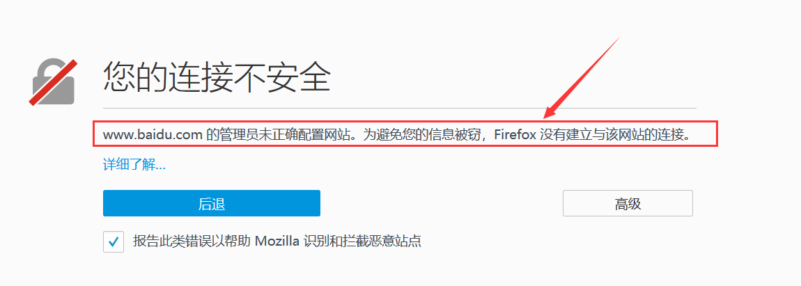
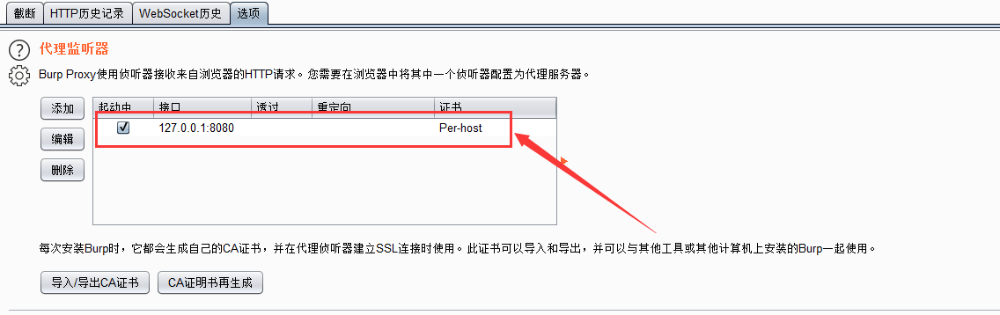
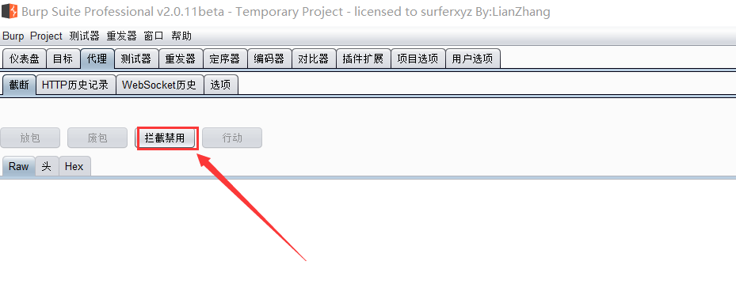
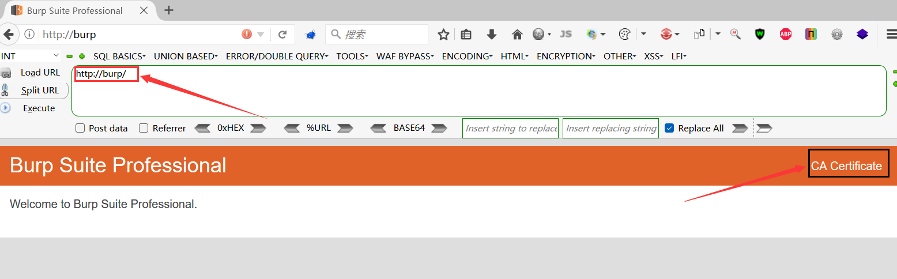
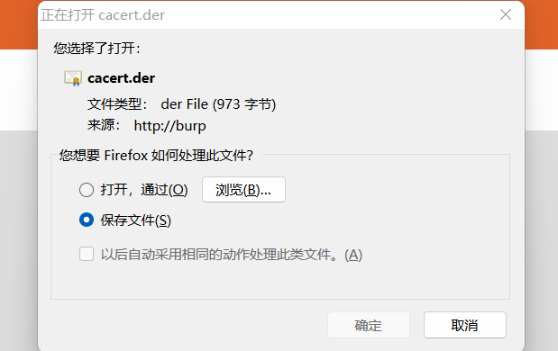
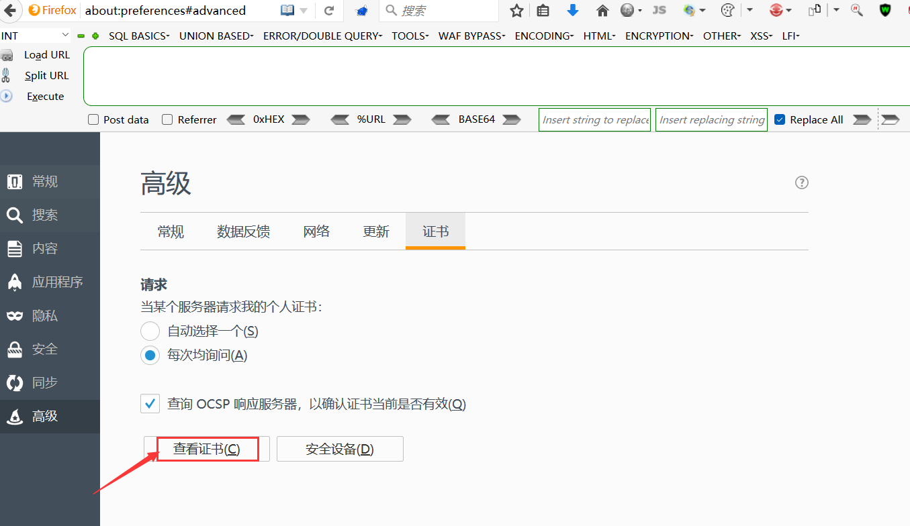
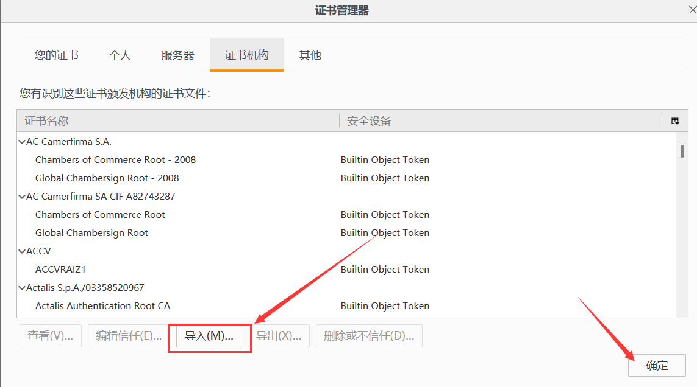
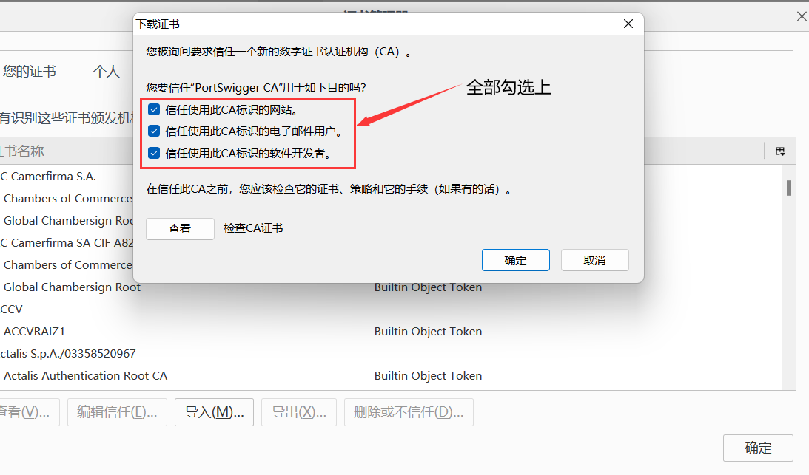
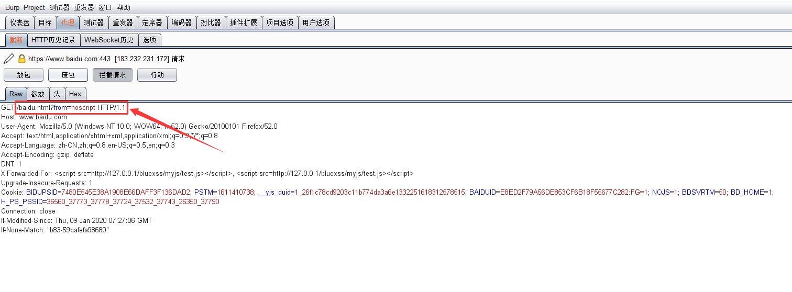

# 问题详情

在首次使用burpsuite对网站进行抓包的时候你可能会遇到如下图所示情况, 这是由于浏览器没有导入CA证书所造成的

# 解决方法

## 1.开启burp代理

打开Burpsuite开启代理, 监听本地的8080端口, 并取消代理的拦截状态

	

## 2.下载CA证书

配置浏览器代理为`127.0.0.1:8080`, 随后访问`http://burp/`, 点击右上角的`CA Certificate`下载证书

	

## 3.导入CA证书

打开火狐浏览器的选项设置, 在高级栏点击查看证书, 然后在证书机构栏导入刚刚下载的CA证书

	

		

		

## 4.抓包测试

导入CA证书后就能正常抓取网站的数据包了, 这里我抓取的是百度的数据包

		

​			

​		