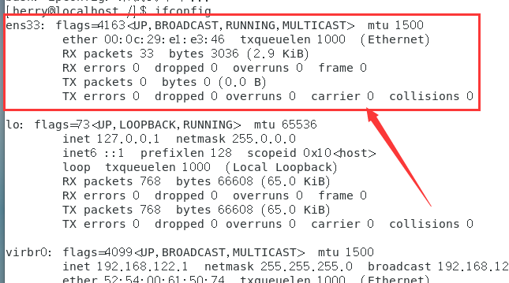
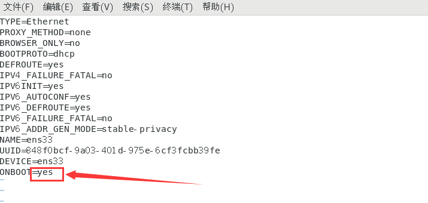
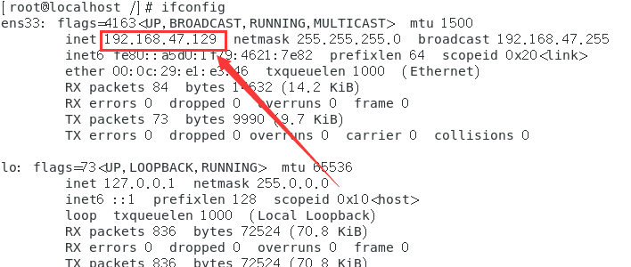

# 问题详情

如图所示, 刚安装好的Centos7系统可能会出现没有配置ip的情况

	

 

# 解决方法

出现这种情况的原因是刚安装的Centos7默认是关闭网卡的,需要打开网卡

 

## 1.修改en33网卡配置文件

输入命令: `vim /etc/sysconfig/network-scripts/ifcfg-ens33` 

修改`ONBOOT=yes`, 修改完按`ESC+:`, 输入`wq`保存文件

	

 

## 2.重启网络

输入重启网络命令: `systemctl restart network`

重启后再次查看ip: `ifconfig`

	