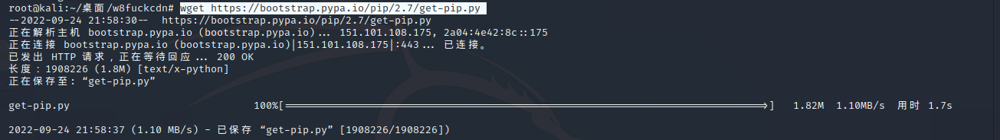
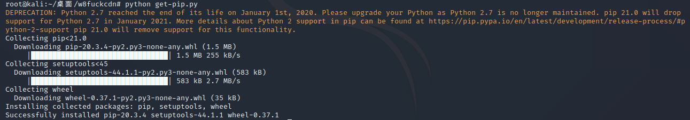

# 问题详情

随着pytho3的强袭崛起, 导致kali在2020的版本中除去了pip2，由于很多之前的黑客工具都是由python2写的，需要通过pip2来安装相应的模块


# 解决方法

## 1.下载`get-pip.py`

```
wget https://bootstrap.pypa.io/pip/2.7/get-pip.py 
```

	


## 2.python执行`get-pip.py`

```
python get-pip.py
```




## 3.判断是否成功安装pip2

```
pip2 -V
```

	