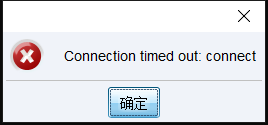
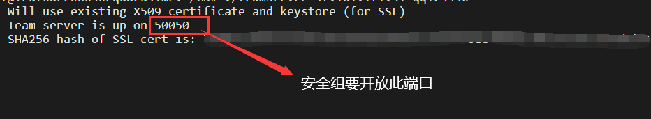
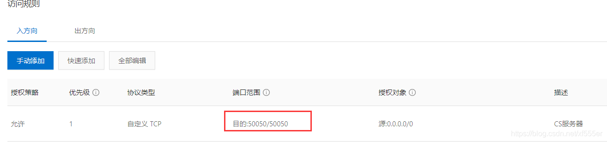

# 一、前言
在云服务器上搭建Cobalt Strike, 你可能会遇到以下的一些小问题, 下面我来依依给大家列举出来


# 二、问题详情

## 1.文件上传

若要将本机的文件上传至云服务器，你需通过Xshell来实现

先在xshell连接云服务器，命令行中执行`rz`命令，即可实现文件上传

> 若没有`rz`命令,则需用到以下命令进行安装(二选一):
>
> - 适用于redhat linux:` yum install lrzsz`
> - 适用于centos或ununtu: `apt-get install lrzsz`


## 2.文件解压

将zip文件上传至服务器, 使用`unzip`命令解压压缩包

```
unzip xxx.zip
```

> 若没有此命令需先安装: apt-get install unzip


## 3.文件权限问题

进入Cobalt Strike的文件目录，你会发现不能执行`teamserver`文件，这是因为你没有给此目录赋予更高的权限,执行以下命令赋予最高权限

```
chmod -R 777 cs目录
```


## 4.安装java环境

配置Cobalt Strike服务需要java环境的支持, 执行如下命令安装java

```
sudo apt-get update
sudo apt-get install default-jdk
```


## 5.CS客户端出现timeout错误

如下图所示, 在登录CS客户端时出现`Connection timed out`错误警告

	


首先检查云服务器安全组配置，开放对应的CS服务器监听端口


	


关闭服务器防火墙，我的服务器系统是ubuntu，每个系统对应的命令是不同的。

```
sudo ufw disable
```


## 6.Cobalt Strike后台执行

若Xshell与云服务器断开了连接, 则Cobalt Strike服务也会相应断开, 但可以通过Screen命令为Cobalt Strike服务设置后台执行

安装Screen：`apt-get install screen`

screen命令的常用操作如下：

- `screen -S yourname`: 新建一个叫yourname的后台任务
- `screen -ls`: 列出当前所有的后台任务
- `screen -r yourname`: 切换至名为yourname的后台任务

若要结束名为yourname的后台任务, 先使用`screen -r yourname`切换至此任务, 然后执行`exit`命令

